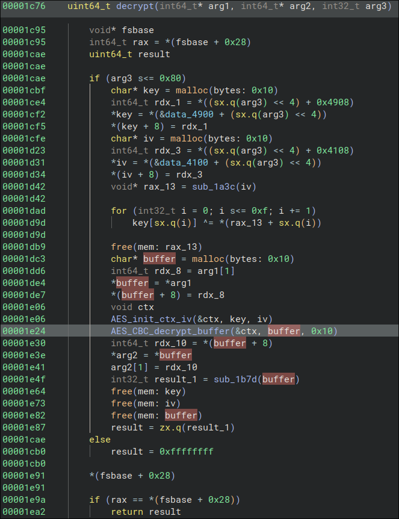
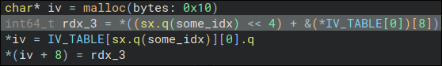

# Write-Up

This reverse challenge exposes an anti-debug technique called **nanomites**. It
prevents reversers from performing a dynamic analysis of a part of the program
as it is already traced by itself.

We will explain a bit more what is the **nanomites technique** in the next section.

If you already know this technique, you can directly jump to the **Solve** section to discover
the resolution of this challenge.

## Small background on PTRACE

I highly recommend [this paper](https://actes.sstic.org/SSTIC06/Playing_with_ptrace/SSTIC06-article-Bareil-Playing_with_ptrace.pdf) to explore the possibilities offered by `ptrace`.

## Solve

First thing first, let's open the binary in a decompiler.

Below is the main function decompiled:


We can see, the program forks a child process. A simple condition on the return value asserts whether the child process executes, whether the father process executes.

>From fork man: `The return value is the zero in the child and the process-id number of the child in the parent, or -1 upon error.`

As it is the only function called, we can name the function called `sub_1259` as `child_main`.

Without entering into too much details, we see a `wait` call and a load of `ptrace` calls in father main. But right now, we don't really know what is traced.
This is why, we can look at `child_main` in a first place.

### Child main


Well, this decompilation is weird in `binaryninja`... From `0x1316`, the decompilation just ... stopped. The instruction just before this address: at  `0x1315` is `0xcc`. This is the `int3` instruction and this is why the decompilation stopped.


Out of curiosity, I will patch this `int3` instruction by `0x90 - NOP instruction` just to see what are those compiled instructions.


This is better. However, with all this `ptrace` context, let's not forget we replace this `int3` instruction. *It could be important :)*.


**Let's dive in**

The first thing it does is `ptrace(PTRACE_TRACEME, 0, 0, 0)`. According to the documentation:

```
$ man 2 ptrace

[...]

PTRACE_TRACEME
              Indicate that this process is to be traced by its parent.  A process
              probably shouldn't make this operation if its parent isn't expecting
              to trace it.  (pid, addr, and data are ignored.)

              The PTRACE_TRACEME operation is used only by the tracee; the remain‐
              ing operations are used only by the tracer.
```

In other words, the child process is now traced by the father, making it impossible to debug dynamically ourselves.

**For the sake of the demonstration, let's try to trace it:**

I break after calling `fork()` to retrieve child PID. Then, I try to attach to it with `gdb`, resulting in:


As you can see, it is already traced by the father, thus, it is impossible for us to analyze it dynamically.

If the `ptrace` call succeeds, `0x3970` value is loaded from `.data` section and is used within a `malloc` call.
We can deduce it is the size of the allocated buffer.

This buffer is then used repeatedly in a loop. The offsetted buffer is an argument of the function `sub_1c76`.

After the loop ends, the program uses `memfd_create` to create an anonymous file.

This is a file linked to a file descriptor that can be handled like a normal file but that lives in the RAM and not in the File System.
It is used with the flags `MFD_CLOEXEC`: the file descriptor would be automatically closed when called from a function of the `exec` family (`fexecve` for instance).

>From the man page:
DESCRIPTION
       memfd_create()  creates  an  anonymous  file and returns a file descriptor that refers to it.  The file behaves like a regular file, and so can be modified, trun‐
       cated, memory-mapped, and so on.  However, unlike a regular file, it lives in RAM and has a volatile backing  storage.

Afterwards, the program writes data from the buffer allocated with `malloc` to the anonymous file and call `fexecve` on the file descriptor.

This implies that at the moment of `fexecve` is called, `buf` contains an executable program: whether a shellcode, whether a complete `ELF`.
Also, the first argument of `child_main` is the `argv` passed to the program executed in `fexecve`. Thus, the main `argv` is passed to the 'program' that runs through `fexecve`.

Okay ! We have a general idea of what is happening here. Below is an intermediate representation of the workflow of the binary.

```
main
 |                            child
fork ----------------------------\
 |                               |
 | <- father                     |
 |                              loop
 |                               |
[...]                            |
 |                           fexecve(buf) --\
 |                               |          |
 |                            no return     |
 |                                          |
 |                                          |
 |                            buf prog  <---/
 |                               |
 |                               |
```

Let's analyze the function within the loop !


Oooh, it seems like some AES decrypt stuff occurs ! Well, that's odd. Why does the function names remain
on these functions ?

They have deliberately been keeped. Maybe we can search for their names on internet ?

Well well well, what do we have here ! We come across https://github.com/kokke/tiny-AES-c. It seems like it has been used !

This is really helpful. Especially the function signatures give out information about types used.

After some changes, the decompilation results in:



**How are the key and the iv defined ?**

`arg3` seems to interfere with their definition: `&data_4900 + (arg3 << 4)`. I guess that
`arg3` is some kind of index that is shifted of 4, resulting in referencing the data blob every 16 bytes.

Okay, so `data_4900` is most likely a blob defining keys ! However, how can we be sure of the length of the key ? AES in CBC mode can accept keys that are: 16, 24 or 32 bytes long. It is likely to be 16 bytes long because of the indexing but we are not 100% sure. Let's name `data_4900` `KEYS_TABLE`.

The operation is repeated to initialize the IV (initialization vector). This time we know IV is 16 bytes long. We can change some name and types !

Below is the final form of `IV_TABLE`:


I guessed the size of the array (0x80) with the size of the data blob. There is exactly 0x80 * 0x10 bytes.

Eh ! 0x80 is exactly the number used in the condition on `arg3 (or some_idx)` at the beginning of the decrypt function. `arg3` **IS** an index for the `IV_TABLE` and `KEYS_TABLE`.



Above is the decompilation of the copy of IV_TABLE indexed value to `iv` allocated buffer. Notice how this pattern copy the last 8 bytes into a temporary variable before copying it into `iv` buffer last 8 bytes.

The exact same pattern is used for copying key bytes. Also, the malloc for the `key` buffer has the size of `0x10`. It means the key size used is 16 bytes ! We can type the KEYS_TABLE more precisely like we did it with IV_TABLE.

Then, a function `sub_1a3c` is called and return bytes used to xor the retrieved key. Finally, the xored key is the final key, used to initialize AES context.

We will analyze this function a little bit later.

The buffer `buffer` allocated is a copy of the first argument of the `decrypt` function. This is the same pattern as seen above for copying 16 bytes.

Then, AES decryption in CBC mode is applied on the buffer inplace. The decrypted buffer is then copied in the second argument of the function `decrypt`.

After that, a function is called on the decrypted buffer and the value is returned. Let's see what it is:


This function seems to hash with SHA256 the decrypted buffer and some static string.

Here is `EVP_DigestFinal` signature: `int EVP_DigestFinal(EVP_MD_CTX *ctx, unsigned char *md, unsigned int *s);`.

From that, we can conclude that the second argument of this function is the resulting hash of: `SHA256(decrypted + "THCON2025")`. Then, the program proceeds to sum all bytes of the hash. Then, it returns the value.

Below is the final decompilation:


**It's time to analyze the function generating the xor_value**


First thing we notice is that it is based on the `iv`. Indeed, the first `for-loop` is copying the first 8 bytes and the last 8 bytes of `iv` into 2 different `int64_t` variable (8 bytes long). We can rename these variables: `iv_low` and `iv_high`.

Then, each variable is used as an argument of a function call. If we look at the decompilation of these 2 functions, we notice they look very similar. Both decompilation are displayed below:


Before analyzing all this messy stuff, the analysis shows the functions return 2 integers on 64 bits which are used to assemble 16 bytes together, which are the bytes xored with the key.

Let's see how these bytes are generated. First, let's name the value based on `iv_low` `lo` and the value based on `iv_high` `hi`.

```
00001b61        for (int32_t i_1 = 0; i_1 s<= 7; i_1 += 1)
00001b31            result[sx.q(i_1)] = ((lo u>> 0x20 | hi << 0x20) u>> (i_1 << 3).b).b
00001b57            result[sx.q(i_1) + 8] = ((hi u>> 0x20 | lo << 0x20) u>> (i_1 << 3).b).b
```

The above instructions basically copy 2 bytes at each iteration: bytes (0, 8), bytes (1, 9), ...
Let's write down in python what it does, a picture is easier than a long explaination:

```python
res = b"\x00"*16
for i in range(8):
    res_1 = (hi & 0xffffffff) << 32 | lo >> 32
    res_2 = (lo & 0xffffffff) << 32 | hi >> 32
    res[i] = (res_1 >> (i << 3))[0] # Shift every 8 bits (every bytes) and keep the lowest
    res[i+8] = (res_2 >> (i << 3))[0]
```

It is equivalent to copying `res_1` in little endian and then copying `res_2` in little endian to a bytes object. The `i << 3` just indicates which byte gets copied.

In the end, it just looks like this:
```
\x12\x34\x56\x78...\x12\x34\x56\x78...
 |            |
 \---------------\
              |  |
     /--------/  |
     v           v
...\x78\x56\x34\x12...\x78\x56\x34\x12
```

**Finally, how are generated these `hi` and `lo` values ?**

Let's analyze one function, the other would be nearly the same.


As decompilation is very messy, I tried IDA decompilation, just to discover it is way clearer.


`qword_4080` is just an array of values of size 16. This explains the `% 16` we see in the decompilation. We can rename it `values_table` because clearly I was out of idea for this name.

Now, it is easy to reimplement it in Python:

```python
K = [11203608954683813621, 16493625149770257099, 14028124698329247043, 14301348153620101778, 6551721942959326409, 4762038057096388576, 3609979849505654858, 1612282650402836386,
     5936503058091595371, 9829764367442340320, 695803877269221422, 3165832863663201199, 290157554447267290, 2714347313732374281, 14592997346911623582, 2752926827304755429]
ARCH = 64

def rol(val, shift):
    return (val << shift) % (2**ARCH) | val >> (ARCH - shift)


def ror(val, shift):
    return val >> shift | (val << (ARCH - shift)) % (2**ARCH)


def generate_low(iv_low: int):
    global K

    state = iv_low
    for i in range(len(K)):
        state ^= K[i]
        state = ror(state, 38)

        state ^= K[(i+2) % len(K)]
        state = rol(state, 45)

        state ^= K[(i+4) % len(K)]
        state = ror(state, 19)

        state ^= K[(i+6) % len(K)]
        state = rol(state, 5)

        state ^= K[(i+8) % len(K)]
        state = ror(state, 27)

        state ^= K[(i+10) % len(K)]
        state = rol(state, 53)

        state ^= K[(i+12) % len(K)]
        state = ror(state, 2)

        state ^= K[(i+14) % len(K)]
        state = rol(state, 4)

    return state
```

No need to say that the other function is very similar, only `ror/rol` values change.

We can implement a decoding algorithm in python based on what we analyzed.

It would look like this:

```python
from Crypto.Cipher import AES
import hashlib
from pwn import xor

BLOCK_SIZE = 16
SALT = b"THCON2025"
ARCH = 64
KEYS = [(), (), ...] # Tuple containing (key, iv) of the same index

K = [11203608954683813621, 16493625149770257099, 14028124698329247043, 14301348153620101778, 6551721942959326409, 4762038057096388576, 3609979849505654858, 1612282650402836386,
     5936503058091595371, 9829764367442340320, 695803877269221422, 3165832863663201199, 290157554447267290, 2714347313732374281, 14592997346911623582, 2752926827304755429]


def rol(val, shift):
    return (val << shift) % (2**ARCH) | val >> (ARCH - shift)


def ror(val, shift):
    return val >> shift | (val << (ARCH - shift)) % (2**ARCH)


def mask_low(iv_low: int):
    global K

    state = iv_low
    for i in range(len(K)):
        state ^= K[i]
        state = ror(state, 38)

        state ^= K[(i+2) % len(K)]
        state = rol(state, 45)

        state ^= K[(i+4) % len(K)]
        state = ror(state, 19)

        state ^= K[(i+6) % len(K)]
        state = rol(state, 5)

        state ^= K[(i+8) % len(K)]
        state = ror(state, 27)

        state ^= K[(i+10) % len(K)]
        state = rol(state, 53)

        state ^= K[(i+12) % len(K)]
        state = ror(state, 2)

        state ^= K[(i+14) % len(K)]
        state = rol(state, 4)

    return state


def mask_high(iv_high: int):
    global K

    state = iv_high
    for i in range(len(K)):
        state ^= K[(i+1) % len(K)]
        state = ror(state, 8)

        state ^= K[(i+3) % len(K)]
        state = rol(state, 56)

        state ^= K[(i+5) % len(K)]
        state = ror(state, 23)

        state ^= K[(i+7) % len(K)]
        state = rol(state, 33)

        state ^= K[(i+9) % len(K)]
        state = ror(state, 13)

        state ^= K[(i+11) % len(K)]
        state = rol(state, 17)

        state ^= K[(i+13) % len(K)]
        state = ror(state, 44)

        state ^= K[(i+15) % len(K)]
        state = rol(state, 40)

    return state


def compute_mask(iv: bytes):
    """iv is 16 bytes long"""
    global K

    iv_low = int.from_bytes(iv[:8], "little")
    iv_high = int.from_bytes(iv[8:], "little")

    state_low = mask_low(iv_low)  # keep highest 32 bits
    state_high = mask_high(iv_high)  # keep highest 32 bits

    hi = (state_low & 0xffffffff) << 32 | state_high >> 32
    lo = (state_high & 0xffffffff) << 32 | state_low >> 32

    mask = b""
    mask += (lo).to_bytes(8, "little")
    mask += (hi).to_bytes(8, "little")

    return mask


def decrypt(ciphertext: bytes):
    if len(ciphertext) % BLOCK_SIZE != 0:
        return "error: invalid padding"

    plain = []
    i = 0
    block = ciphertext[:BLOCK_SIZE]
    next = 25
    while block != b"":
        (key, iv) = KEYS[next]

        mask = compute_mask(iv)
        key_final = xor(key, mask)
        print(key_final, iv)

        aes = AES.new(key_final, AES.MODE_CBC, iv=iv)
        plain.append(aes.decrypt(block))

        compute_next_idx(plain[-1]) # use ?
        i += 1 << 4
        block = ciphertext[i:i + BLOCK_SIZE]

    return b"".join(plain)


def compute_next_idx(plaintext: bytes) -> int:
    h = hashlib.sha256(plaintext+SALT)
    h = h.digest()

    sum = 0
    for i in range(len(h)):
        sum += h[i]

    return sum
```

Running this won't retrieve the executable. Something is missing. Remember the `int3` instruction ? Well, as the process is traced, after a **SIGTRAP** the execution is returned to the father process. It may do things with the return value of `decrypt` function. Let's see !

### Father main


The `wait` will literally wait for a signal from the child process, like **SIGTRAP** from `int3` for example. Then, the check performed is a macro defined in `waitstatus.h` [linux headers](https://codebrowser.dev/qt6/include/x86_64-linux-gnu/bits/waitstatus.h.html). It checks whether the child process exitted or not.

If not, `ptrace` is called with `PTRACE_GETREGS`. As the name states it, the father process retrieves general registers of the child process. The data obtained is of the type: `user_regs_struct`.

>You can get details on the struct with the command `pahole user_regs_struct`.

We can type the variable `var_e8` to `struct user_regs_struct`. The decompilation updates and shows that `rax` register is used !


The call to `ptrace` with `PTRACE_PEEKDATA` allows to retrieve data at the given address, here `some_idx` which is index passed to the `decrypt` function to retrieve the key and the `IV`.

Then, the value returned by ptrace is multiplied by 5 after being summed with `rax`. If we call the value `x`, the following operations are applied:

```
(5x) + ((5x) << 2) = (5 + (5 << 2))*x = 25x
```

This is some `binaryninja` magic I guess, IDA is once again clearer on this decompilation. Anyway, we get the right result in the end.

After this, the value is written back to `some_idx` with `PTRACE_POKEDATA`. The written value is equivalent to: `(25 * (some_idx + regs.rax)) % 0x80`, where `regs.rax` is the returned value of `decrypt`, which is the `sum_sha256(last_block_decrypted)`.

Finally a last call to `ptrace` is done to continue the execution in the child process: `PTRACE_CONT`.

We have it ! `some_idx` is in fact modified, just not in the child process. We can complete the `decrypt.py` script.

### Retrieve embedded binary

Finally, after some modifications, we can retrieve the blob of encrypted data and apply the script on it.

You can find the final script [here](./decrypt.py). The encrypted data is in the file [encrypted](./encrypted). The sha256 of the encrypted data is: `02b74cd84f413b12e5a51ba9758a357564e688720c9a1d7c2c94d997ef08f25f`, if you want to verify you have the right blob.

After running it, a `decrypted` file is created.

Running `file` command on it gives out the following output.

```bash
$ file decrypted
decrypted: ELF 64-bit LSB pie executable, x86-64, version 1 (SYSV), dynamically linked, interpreter /lib64/ld-linux-x86-64.so.2, BuildID[sha1]=d619f8a3d5f44ef152326536060674b59d4a5904, for GNU/Linux 4.4.0, not stripped
```

It is an embedded ELF binary indeed, let's analyze this file !

### Embedded binary

Let's open it in `binaryninja`.


I replace names of easy to guess symbols.

Nothing fancy, there is a function that checks the `argv[1]` we enter.

The first check to pass is `sha256(input) == "..."`. It basically gives out the sha256 of the flag. However, I doubt we can bruteforce the hash. Flags are often quite long and written in l33t, making them quite robust password.

So this is useless for us.

Nevertheless, the second function called seems to encrypt our input into some value which is hardcoded. Let's dive in this `encrypt` function.


A buffer is allocated, which receives `buffer[i] = input[i] ^ "THCon2025"[(i+1)%9]`.

Then, a function called `randomized_base64` is called. The name was not stripped. The function in itself is quite long. If one familiarize himself with base64 encoding, he could tell this is an implementation of base64 encoding. The only difference is the last argument. It is used to generate the final output.

The hardcoded string: `"IcU/4SfFP6um+VJw8lWibvrtsRqT5Q7dy9o2M0gjBnDaxzNHCGZ3EOkYXAhLe1pK"` is exactly 64 char long.

We can conclude this is 'randomized' in the sense it uses a randomized alphabet compared to basic base64 encoding.

We have it. The flag is xored with a key and then encoded in base64 but with a custom alphabet.

We just need to reverse the encoding and then xor back to the flag.

To reverse the base64 encoding with a custom alphabet, we can use [Cyberchef](https://gchq.github.io/CyberChef/) that allows to enter a custom alphabet.

Or we can code the algorithm ourselves:

```python
def decode_custom_base64(input: str, alphabet: str):
    bininput = ""
    for i in range(len(input)):
        idx = alphabet.find(input[i])
        if idx == -1: # must be =
            bininput += "0"*6
        else:
            bininput += bin(idx)[2:].zfill(6)

    assert len(bininput)%8 == 0

    res = b""
    for i in range(0, len(bininput), 8):
        res += int(bininput[i:i+8], 2).to_bytes(1, "little")

    while res.endswith(b"\x00"):
        res = res[:-1]
    return res
```

Finally, we have evrything we need to retrieve the flag. Indeed, the encrypted flag is given in the `strncmp` call where it is hardcoded.

### Find the flag

Here is the final script to obtain the flag.

```python
ALPHABET = "IcU/4SfFP6um+VJw8lWibvrtsRqT5Q7dy9o2M0gjBnDaxzNHCGZ3EOkYXAhLe1pK"
FLAG_ENCRYPTED = "FIxxS8RHv8bL/cC5wgcGWknMm9CfIf4/br41UYPmtrOkIg5mwIzdF8SHdI4h7IA7f0Q/iC=="
KEY = b"THCon2025"


def decode_custom_base64(input: str, alphabet: str):
    bininput = ""
    for i in range(len(input)):
        idx = alphabet.find(input[i])
        if idx == -1: # must be =
            bininput += "0"*6
        else:
            bininput += bin(idx)[2:].zfill(6)

    assert len(bininput)%8 == 0

    res = b""
    for i in range(0, len(bininput), 8):
        res += int(bininput[i:i+8], 2).to_bytes(1, "little")

    while res.endswith(b"\x00"):
        res = res[:-1]
    return res


def decrypt(input: bytes):
    flag = ""
    for i in range(len(input)):
        flag += chr(input[i] ^ KEY[(i + 1) % len(KEY)])

    return flag


if __name__ == "__main__":
    # print(decode_custom_base64(FLAG_ENCRYPTED, ALPHABET))
    raw_flag = decode_custom_base64(FLAG_ENCRYPTED, ALPHABET)
    print("Flag:", decrypt(raw_flag))
```

This will print: `Flag: THC{4_g0oD_sPRAy_0f_inS3cTiC1d3_F0R_tH0s3_N4n0M1tes}`