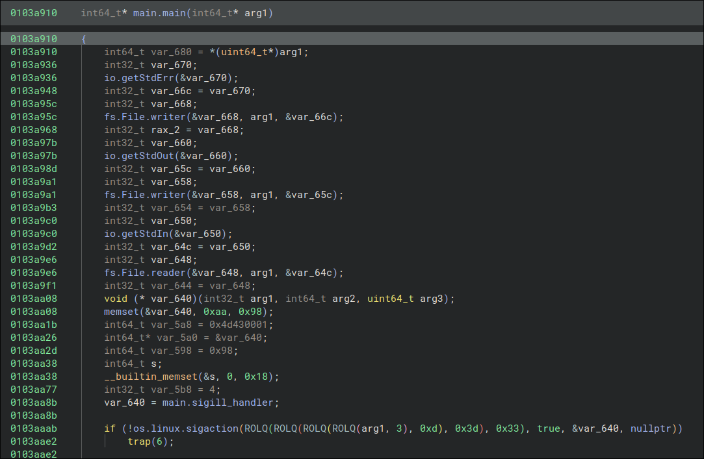

# Write-Up

As always, let's see what basic information we have on the binary.

```bash
file zigzauthg 
zigzauthg: ELF 64-bit LSB executable, x86-64, version 1 (SYSV), statically linked, not stripped
```

Nothing fancy, this is a classic ELF binary on x64 architecture.

We notice the file is not stripped, which will ease our reversing task.

# First view

When opening the binary in a decompiler, we notice that the `main` is located in a function named: `main.main`.

This might be surprising at first but like *Golang*, all function coming from the `main` package would be prefixed by this `main.` string.

Quickly, we understand that `main.check_login`, `main.char_sum`, `main.char_product` to name a few are important to us.

Let's see what the `main.main` looks like as it is the entry point of the program:



By searching the function names on the internet, we found the standard documentation of Zig language. We can deduce this binary has been written in Zig.

The calls to `io.getStdErr`, `io.getStdIn` and `io.getStdOut` are common in Zig so nothing fancy here. They simply acquire a `File` whether as a `reader` whether as a `writer`. In the end, we can see that it is stored in a variable like some file descriptor in C.

```C
io.getStdErr(&var_670)
int32_t var_66c = var_670
int32_t stderr
fs.File.writer(&stderr, arg1, &var_66c)
int32_t stderr_1 = stderr
```

We can then rename `var_668` as stderr and so on for `stdin` and `stdout`.

After these formalities, we notice a call to `os.linux.sigaction`. Here is the [documentation](https://ziglang.org/documentation/master/std/#std.os.linux.sigaction).

The documentation of Zig not being very clear, we can look at the man of sigaction in C. This is way clearer and we even have some example of how one can use it.

The first argument is the signal number that, if received, a new behavior will be registered through this function call. The second argument will be a `struct sigaction` structure that especially contains the handler called when the signal provided is raised. This handler is the function `main.sigill_handler`.

As this name suggests, it is a handler for the signall `SIGILL`. It can be easily verified as within the handler, it checks the signal number is equal to 4 before performing any actions. By checking [this page](https://faculty.cs.niu.edu/~hutchins/csci480/signals.htm), we see the signall 4 is for `SIGILL - Illegal Instruction`.

# The handler

The handler have the signature: `void main.sigill_handler(int32_t signo, struct siginfo_t* si, struct ucontext* ucontext)`

Here is the type `ucontext`:

```C
struct ucontext
{
    uint64_t uc_flags;
    struct ucontext* uc_link;
    struct stack_t uc_stack;
    struct sigcontext_64
        uc_mcontext;
    uint64_t uc_sigmask;
};

struct sigcontext_64
{
    __u64 r8;
    __u64 r9;
    __u64 r10;
    __u64 r11;
    __u64 r12;
    __u64 r13;
    __u64 r14;
    __u64 r15;
    __u64 di;
    __u64 si;
    __u64 bp;
    __u64 bx;
    __u64 dx;
    __u64 ax;
    __u64 cx;
    __u64 sp;
    __u64 ip;
    __u64 flags;
    __u16 cs;
    __u16 gs;
    __u16 fs;
    __u16 ss;
    __u64 err;
    __u64 trapno;
    __u64 oldmask;
    __u64 cr2;
    __u64 fpstate;
    __u64 reserved1[0x8];
};
```

You can obtain this information with the command `pahole` for instance: `pahole ucontext` and `pahole sigcontext_64`.

Replacing this in the decompiler gives a better decompilation:

```C
0103c520    void main.sigill_handler(int32_t signo, struct siginfo_t* si, struct ucontext* ucontext)
0103c532        int32_t signo_1 = signo
0103c538        struct siginfo_t* si_1 = si
0103c53f        struct ucontext* ucontext_1 = ucontext
0103c54d        void var_138
0103c54d        void* var_30 = &var_138
0103c551        int64_t var_28 = 0x20
0103c559        int64_t var_38 = 0
0103c559        
0103c57c        if (signo == 4 && ucontext != 0)
0103c58b            struct ucontext* ucontext_2 = ucontext
0103c58b            
0103c597            if ((ucontext & 7) != 0)
0103c5e4                debug.FullPanic((function 'defaultPanic')).incorrectAlignment(&var_38)
0103c5e4                noreturn
0103c5e4            
0103c5a8            struct ucontext* ucontext_3 = ucontext
0103c5c5            uint64_t ip = ucontext->uc_mcontext.ip
0103c5cc            bool c_1 = ip u>= -2
0103c5d7            __u64 rax_5
0103c5d7            rax_5.b = c_1
0103c5d7            
0103c5da            if (c_1)
0103c5ed                debug.FullPanic((function 'defaultPanic')).integerOverflow(&var_38)
0103c5ed                noreturn
0103c5ed            
0103c600            ucontext->uc_mcontext.ip = ip + 2
0103c603            uint32_t main.exception_count_1 = main.exception_count
0103c60a            bool c_2 = main.exception_count_1 u>= 0xffffffff
0103c613            int32_t rax_7
0103c613            rax_7.b = c_2
0103c613            
0103c616            if (c_2)
0103c61e                debug.FullPanic((function 'defaultPanic')).integerOverflow(&var_38)
0103c61e                noreturn
0103c61e            
0103c629            main.exception_count = main.exception_count_1 + 1
```

Well basically, when a `SIGILL` is raised, `rip` is increased by 2 and a counter by 1. The error handling seems internal to Zig compiler.

For now, we don't really now why all this machinery is defined but we get it: `SIGILL` means a counter increased and messing with `rip`.

Returning to `main.main`, if `sigaction` call succeed, we jump to some assembly code where `ud2` instruction is called.

What is this instruction ?

# This is illegal

According to intel documentation, it generates an `invalid opcode exception`. This is what raises the `SIGILL` signals ! It is simply a trap for the decompiler, which stops the decompilation. Because we want to explore the rest of the program we should patch this instruction as it does nothing. 

Let's patch it by `NOP` operations.

I replace: `0f0b` by `9090`.

>Note that the instruction is 2 bytes long, remember the `rip += 2` in the handler ? :)

Once I patched it, the decompilation continues.

`main.banner` is called, basically, it prints something to the `stdout`. And then a lot of junk that seems to do absolutely nothing. This might be code generated by the compiler itself that checks everything got printed correctly.

# ReadInput

After the compiler magic, the function `io.Reader.readUntilDelimiter` is called which is likely to read `stdin` stream.

The [documentation](https://ziglang.org/documentation/master/std/#std.io.Reader.readUntilDelimiter) is pretty clear: stdin.readUntilDelimiter(buf, delimiter).

`io.Reader.readUntilDelimiter(&var_3f0, arg1, &stdin_stream, var_700, 0x40, '\n');`

`var_700, 0x40` seems to be the buffer intern structure. So it reads from `stdin` and stores our input in a buffer of `0x40` bytes. Yet, the function also returns the string read so `var_3f0` also points to our input. I know this is weird right ?

Then, it prints a border `+--------------...-----+` and another `ud2` comes in.

We can patch it again, as done above, to get the rest of the decompilation.

# The login

After the second patch, we observe the call to the function `main.check_login`.

```C
0103ce40    int64_t main.check_login(int64_t* arg1, char *login, int64_t size_login)
0103ce5a        int64_t var_30 = size_login
0103ce5e        int64_t var_38 = login
0103ce6c        char const* const var_28 = "TeerthdwhSceSao"
0103ce70        int64_t var_20 = 0
0103ce70        
0103ce91        while (true)
0103ce91            if (var_20 u>= size_login)
0103ce7a                int64_t result
0103ce7a                result.b = 1
0103ce81                return result
0103ce81            
0103cea7            int64_t var_18_1 = var_20
0103ceb0            int64_t rax_5
0103ceb0            int64_t rdx
0103ceb0            rdx:rax_5 = mulu.dp.q(var_20, 2)
0103ceb0            bool o_1 = mulu.dp.q(var_20, 2) u>> 0x40 != zx.o(0)
0103ceb3            int64_t var_60_1 = rax_5
0103ceb7            rax_5.b = o_1
0103ceb7            
0103ceba            if (o_1)
0103cec4                debug.FullPanic((function 'defaultPanic')).integerOverflow(arg1)
0103cec4                noreturn
0103cec4            
0103ced1            if (size_login == 0)
0103cefb                debug.FullPanic((function 'defaultPanic')).divideByZero(arg1)
0103cefb                noreturn
0103cefb            
0103cedf            uint64_t temp1_1 = modu.dp.q(0:var_60_1, size_login)
0103ceea            uint64_t var_10_1 = temp1_1
0103ceea            
0103cef1            if (temp1_1 u>= size_login)
0103cf2a                debug.FullPanic((function 'defaultPanic')).outOfBounds(arg1, temp1_1)
0103cf2a                noreturn
0103cf2a            
0103cf0e            int64_t rcx_3
0103cf0e            rcx_3.b = *(login + temp1_1)
0103cf0e            
0103cf18            if (var_20 u> 0xf)
0103cf50                debug.FullPanic((function 'defaultPanic')).outOfBounds(arg1, var_20)
0103cf50                noreturn
0103cf50            
0103cf2f            int64_t rax_9
0103cf2f            rax_9.b = rcx_3.b
0103cf2f            
0103cf3d            if (rax_9.b != (*"TeerthdwhSceSao")[var_20])
0103cf3d                break
0103cf3d            
0103ce9d            var_20 += 1
0103ce9d        
0103cf5c        return 0
```

Obviously, `var_20` is the loop counter.

This function is performing `login[(2*i)%len(login)] == "..."[i]`. The function is easily reversible and as the string against which each char is checked we can deduce the login with this simple script:

```python
def find_login():
    login = "TeerthdwhSceSao"

    find = [""]*len(login)
    for i in range(len(login)):
        find[(2*i) % len(login)] = login[i]

    return "".join(find)
```

It outputs the login: `TheSecretShadow`.

# The flag

After patching some other `ud2` instruction, we recognize the next pattern as it is asking for an input like it did with the login.

Moving along, we continue to patch these `ud2` instructions.

Then, a call to `main.char_sum` happens with the login buffer.

As its name suggests it, it sums the char ASCII value over a buffer:

```C
0103cfe0    uint64_t main.char_sum(int64_t* arg1, char* buf, int64_t size)
0103cffa        int64_t size_1 = size
0103cffe        char* buf_1 = buf
0103d002        int32_t sum = 0
0103d002        
0103d02b        for (int64_t i = 0; i u< size; i += 1)
0103d045            int64_t char
0103d045            char.b = buf[i]
0103d048            char var_9_1 = char.b
0103d04e            uint32_t char_value = zx.d(char.b)
0103d051            bool c_1 = sum + char_value u< sum
0103d056            int32_t rax_8
0103d056            rax_8.b = c_1
0103d056            
0103d059            if (c_1)
0103d063                debug.FullPanic((function 'defaultPanic')).integerOverflow(arg1)
0103d063                noreturn
0103d063            
0103d06b            sum += char_value
0103d06b        
0103d01b        return zx.q(sum)
```

After this, the decompilation is kinda weird:

```C
0103bc1c        int32_t login_sum = main.char_sum(arg1, buf: login_buf, size: var_728)
0103bc27        int32_t login_sum_1 = login_sum
0103bc2d        int32_t var_144 = 0
0103bc37        int64_t var_140 = 0
0103bc37        
0103bc6a        if (0 u< var_800)
0103bc84            char* var_138
0103bc84            memset(&var_138, 0xaa, 0x10)
0103bc90            sigaction.sa_restorer = 0x4d430001
0103bc9b            char** var_5a0_3 = &var_138
0103bca2            int64_t var_598_3 = 0x10
0103bcad            int64_t s_3
0103bcad            __builtin_memset(s: &s_3, c: 0, n: 0x18)
0103bcf3            bool c_1 = var_140 u>= -4
0103bcfe            int64_t rax_96
0103bcfe            rax_96.b = c_1
0103bcfe            
0103bd01            if (c_1)
0103bd6b                debug.FullPanic((function 'defaultPanic')).integerOverflow(arg1)
0103bd6b                noreturn
0103bd6b            
0103bd81            int64_t var_130_1
0103bd81            
0103bd81            if (var_140 + 4 u>= var_800)
0103bde8                if (var_140 u> var_800)
0103bf2d                    debug.FullPanic((function 'defaultPanic')).startGreaterThanEnd(arg1, var_140)
0103bf2d                    noreturn
0103bf2d                
0103bf12                if (var_800 u> var_800)
0103bf5e                    debug.FullPanic((function 'defaultPanic')).outOfBounds(arg1, var_800)
0103bf5e                    noreturn
0103bf5e                
0103bf43                if (var_140 u> var_800)
0103bf9b                    debug.FullPanic((function 'defaultPanic')).outOfBounds(arg1, var_140)
0103bf9b                    noreturn
0103bf9b                
0103bf71                var_130_1 = var_800 - var_140
0103bf78                var_138 = &var_7f8[var_140]
0103bd81            else
0103bd98                bool c_2 = var_140 u>= -4
0103bda3                int64_t rax_100
0103bda3                rax_100.b = c_2
0103bda3                
0103bda6                if (c_2)
0103bdfa                    debug.FullPanic((function 'defaultPanic')).integerOverflow(arg1)
0103bdfa                    noreturn
0103bdfa                
0103be36                if (var_140 u> var_140 + 4)
0103be7a                    debug.FullPanic((function 'defaultPanic')).startGreaterThanEnd(arg1, var_140)
0103be7a                    noreturn
0103be7a                
0103be5f                if (var_140 + 4 u> var_800)
0103beab                    debug.FullPanic((function 'defaultPanic')).outOfBounds(arg1, var_140 + 4)
0103beab                    noreturn
0103beab                
0103be90                if (var_140 u> var_140 + 4)
0103bee8                    debug.FullPanic((function 'defaultPanic')).outOfBounds(arg1, var_140)
0103bee8                    noreturn
0103bee8                
0103bebe                var_130_1 = var_140 * 0 + 4
0103bec5                var_138 = &var_7f8[var_140]
0103bec5            
0103bd59            if (((main.check_chunk(arg1, var_138, var_130_1, login_sum, var_140 u>> 2) ^ 0xff) & 1) == 0)
0103bfa7                trap(6)
```

Once again, a `trap(6) = ud2` laid in the program assembly. After patching it, it makes much more sense:

```C
0103bc1c        int32_t login_sum = main.char_sum(arg1, buf: login_buf, size: var_728)
0103bc27        int32_t login_sum_1 = login_sum
0103bc2d        int32_t var_144 = 0
0103bc6a        uint64_t i
0103bc6a        uint64_t rax_94
0103bc6a        
0103bc6a        for (i = 0; i u< var_800; i += 4)
0103bc84            char* var_138
0103bc84            memset(&var_138, 0xaa, 0x10)
0103bc90            sigaction.sa_restorer = 0x4d430001
0103bc9b            char** var_5a0_3 = &var_138
0103bca2            int64_t var_598_3 = 0x10
0103bcad            int64_t s_3
0103bcad            __builtin_memset(s: &s_3, c: 0, n: 0x18)
0103bcf3            bool c_1 = i u>= -4
0103bcfe            int64_t rax_96
0103bcfe            rax_96.b = c_1
0103bcfe            
0103bd01            if (c_1)
0103bd6b                debug.FullPanic((function 'defaultPanic')).integerOverflow(arg1)
0103bd6b                noreturn
0103bd6b            
0103bd81            int64_t var_130_1
0103bd81            
0103bd81            if (i + 4 u>= var_800)
0103bde8                if (i u> var_800)
0103bf2d                    debug.FullPanic((function 'defaultPanic')).startGreaterThanEnd(arg1, i)
0103bf2d                    noreturn
0103bf2d                
0103bf12                if (var_800 u> var_800)
0103bf5e                    debug.FullPanic((function 'defaultPanic')).outOfBounds(arg1, var_800)
0103bf5e                    noreturn
0103bf5e                
0103bf43                if (i u> var_800)
0103bf9b                    debug.FullPanic((function 'defaultPanic')).outOfBounds(arg1, i)
0103bf9b                    noreturn
0103bf9b                
0103bf71                var_130_1 = var_800 - i
0103bf78                var_138 = &var_7f8[i]
0103bd81            else
0103bd98                bool c_3 = i u>= -4
0103bda3                int64_t rax_102
0103bda3                rax_102.b = c_3
0103bda3                
0103bda6                if (c_3)
0103bdfa                    debug.FullPanic((function 'defaultPanic')).integerOverflow(arg1)
0103bdfa                    noreturn
0103bdfa                
0103be36                if (i u> i + 4)
0103be7a                    debug.FullPanic((function 'defaultPanic')).startGreaterThanEnd(arg1, i)
0103be7a                    noreturn
0103be7a                
0103be5f                if (i + 4 u> var_800)
0103beab                    debug.FullPanic((function 'defaultPanic')).outOfBounds(arg1, i + 4)
0103beab                    noreturn
0103beab                
0103be90                if (i u> i + 4)
0103bee8                    debug.FullPanic((function 'defaultPanic')).outOfBounds(arg1, i)
0103bee8                    noreturn
0103bee8                
0103bebe                var_130_1 = i * 0 + 4
0103bec5                var_138 = &var_7f8[i]
0103bec5            
0103bd55            rax_94.b = main.check_chunk(arg1, var_138, var_130_1, login_sum, i u>> 2).b ^ 0xff
0103bd55            
0103bd59            if ((rax_94.b & 1) != 0)
0103bd59                break
0103bd59            
0103bfb7            int32_t rax_111 = main.char_product(arg1, var_138, var_130_1)
0103bfbc            int32_t var_128_1 = rax_111
0103bfc8            var_144 ^= rax_111
0103bd11            bool c_2 = i u>= -4
0103bd1c            uint64_t rax_98
0103bd1c            rax_98.b = c_2
0103bd1c            
0103bd1f            if (c_2)
0103bfe1                debug.FullPanic((function 'defaultPanic')).integerOverflow(arg1)
0103bfe1                noreturn
```

There is a loop ! Let's see what it does:

the main function called are: `main.check_chunk` and `main.char_product`.

`main.char_product` is kind of explicit once we saw `main.char_sum`.

As for `main.check_chunk`, this is the most interesting for us as it seems to check chunks of the passphrase we entered.

```C
0103d120    uint64_t main.check_chunk(int64_t* arg1, char* chunk, int64_t size, int32_t login_sum, int64_t idx_shifted)

0103d147        int64_t size_2 = size
0103d14b        char* chunk_1 = chunk
0103d14f        int32_t login_sum_1 = login_sum
0103d152        int64_t idx_shifted_1 = idx_shifted
0103d152        
0103d162        if (size != 4)
0103d18c            return 0
0103d18c        
0103d172        int64_t size_1 = size
0103d172        
0103d17e        if (2 u> size)
0103d1d2            debug.FullPanic((function 'defaultPanic')).outOfBounds(arg1, 2)
0103d1d2            noreturn
0103d1d2        
0103d1bf        if (idx_shifted u>= 7)
0103d215            debug.FullPanic((function 'defaultPanic')).outOfBounds(arg1, idx_shifted)
0103d215            noreturn
0103d215        
0103d202        if (((mem.eql__anon_3508(arg1, chunk, 2, (&data_1004720)[idx_shifted * 2], *((idx_shifted << 4) + 0x1004728)) ^ 0xff) & 1) != 0)
0103d224            return 0
0103d224        
0103d19b        if (2 u>= size)
0103d284            debug.FullPanic((function 'defaultPanic')).outOfBounds(arg1, 2)
0103d284            noreturn
0103d284        
0103d25a        char* rax_10
0103d25a        rax_10.b = chunk[2]
0103d267        uint32_t rax_12 = zx.d(rax_10.b) ^ main.exception_count
0103d269        bool c = rax_12 + login_sum u< rax_12
0103d26e        int32_t rax_13
0103d26e        rax_13.b = c
0103d26e        
0103d271        if (c)
0103d28d            debug.FullPanic((function 'defaultPanic')).integerOverflow(arg1)
0103d28d            noreturn
0103d28d        
0103d29a        if (idx_shifted u>= 7)
0103d2bf            debug.FullPanic((function 'defaultPanic')).outOfBounds(arg1, idx_shifted)
0103d2bf            noreturn
0103d2bf        
0103d2ac        if (rax_12 + login_sum != *((idx_shifted << 2) + &data_1004790))
0103d2ce            return 0
0103d2ce        
0103d236        int32_t rax_8 = main.char_product(arg1, buf: chunk, size)
0103d236        
0103d248        if (idx_shifted u>= 7)
0103d2ff            debug.FullPanic((function 'defaultPanic')).outOfBounds(arg1, idx_shifted)
0103d2ff            noreturn
0103d2ff        
0103d2e4        uint64_t result
0103d2e4        result.b = rax_8 == *((idx_shifted << 2) + &data_10047ac)
0103d2ef        return result
```

The first check indicates that the chunks are 4 chars long. Else it returns false.

As it is 4 chars long, the last argument of the function is likely to be the index of the chunk being checked.

`i >> 2 = i/4` and each chunks are 4 chars long.

The second check calls [this standard function](https://ziglang.org/documentation/master/std/#std.mem.eql). The decompilation is not very clear but since the beginning, when a buffer was implied, the size of it was given as a parameter after it.

It means: `mem.eql__anon_3508(arg1, chunk, 2, (&string_array)[idx_chunk * 2], *((idx_chunk << 4) + &data_1004728)` compares the 2 first characters of `chunk` with the `&string_array`. Going to the reference, we see multiple string of length 2. Respectively: `['TH', 'd0', '_K', 'w_', 'g_', 'nG', 'g3']`.

The third check is doing some operation and checks it on an array containing the result for each chunk (according to the chunk_idx). It xors the third character with the value of the counter incremented in the `sigill_handler`. Then it adds the `login_sum` value to it before checking if it finds the correct result. The difficulty of this check is to remember how much `ud2` we patched :).

The last one we patch was a `ud2` instruction called within the loop, meaning it increases at each chunk checked. Also, before starting the loop, we patched 4 `ud2` instructions.

So this variable can be seen as a variable initialized to 4 at the beginning of the loop and increased at each iteration.

The final check is over the product of all chars within the chunk. The result is compared to the one in a hardcoded array.

All these checks can be reversed quite easily:
- The 2 first characters are given as it is a string to string comparison
- The third one can be deduced by simple operations, exploiting the inversible behavior of the XOR
- The last one can be found by taking the product value and divides it by the product of the 3 known chars. It will give the last character.

# Final solve script

Here is my final [solve script](./solve.py)

This will give the flag: `THC{d0_U_Kn0w_z1g_L4nGu4g3?}`